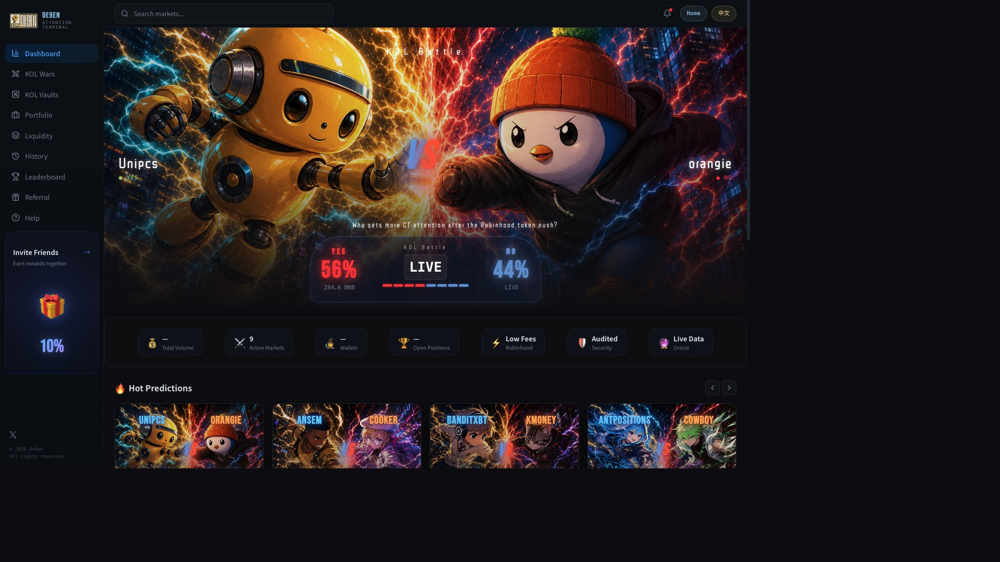
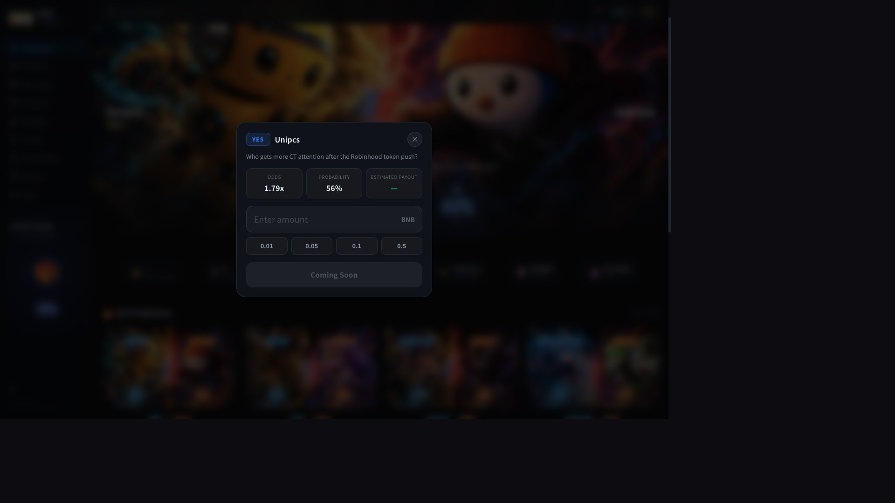
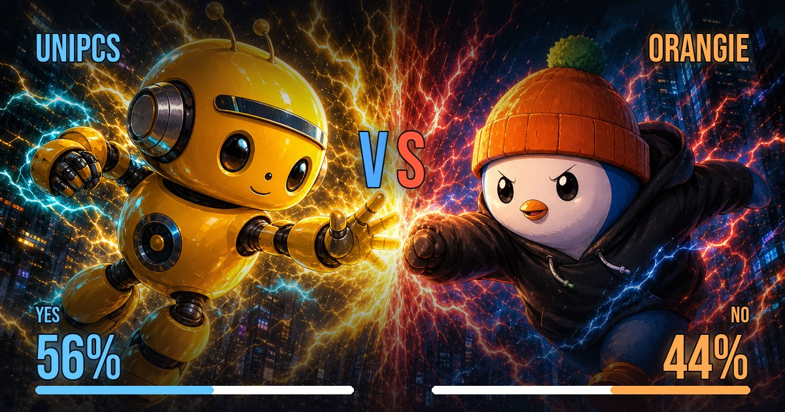

# De9en — Attention Markets

De9en turns KOL attention into agent-tradable prediction markets. Each question
is a head-to-head **KOL battle** (KOL Wars): buyers take YES/NO on which creator
wins a weekly attention narrative, and the resulting odds, volume, and mindshare
ranking become a structured signal other agents can consume.

This package contributes a reusable ACP skill,
[`acp-attention-market-signal`](skills/acp-attention-market-signal/SKILL.md),
that models each market as a priced ACP offering returning one stable signed
deliverable envelope — so a provider agent can sell De9en attention/odds signals
and a buyer agent integrates once across every market.

## Integration status: PLANNED

To be explicit about what is and isn't running:

- **Live now (product):** the attention-market app at
  [de9en.app](https://de9en.app/dashboard) — a public dashboard, the KOL Wars
  grid, and per-market share cards. See [Product Demo](#product-demo) below.
- **Planned (ACP integration):** the ACP rail in this package (offerings
  catalog, signed deliverable envelope, provider skill, and soul) is a **design
  contract, not a live deployment**. There is **no completed ACP job and no
  on-chain settlement** yet. This package documents how De9en will expose its
  live market to buyer agents over ACP once the on-chain integration ships.

## Product Demo

How the product is used today: browse the KOL Wars grid, pick a battle, take
YES or NO on which creator wins the week's attention, and watch live odds,
volume, and mindshare update. Each battle also produces a shareable card.

**1. Dashboard — KOL Wars grid with live odds, volume, and mindshare ranking.**



**2. Placing a position — pick YES/NO on a battle; see odds, probability, and estimated payout (on-chain trading coming soon).**



**3. Shareable battle card — the same market odds rendered for agent/social sharing.**



Live to try: https://de9en.app/dashboard

## Package contents

| Path | What it is |
| --- | --- |
| [`showcase.json`](showcase.json) | Showcase manifest |
| [`skills/acp-attention-market-signal/SKILL.md`](skills/acp-attention-market-signal/SKILL.md) | Reusable provider skill |
| [`offerings/offerings.json`](offerings/offerings.json) | ACP offerings catalog (one per market kind) |
| [`examples/attention-signal-envelope.json`](examples/attention-signal-envelope.json) | Redacted deliverable envelope example |
| [`soul.md`](soul.md) | Provider identity and guardrails |

## Deliverable contract

Every offering returns the same signed envelope so a buyer integrates once:

```json
{
  "signal": "kol-battle-odds",
  "market": "<market-slug>",
  "source": "de9en (de9en.app)",
  "delivered_at": "<ISO-8601>",
  "disclaimer": "Informational only — not financial advice.",
  "data": { "question": "...", "yes": {}, "no": {}, "mindshare_rank": 0 }
}
```

## Proof

- Product demo screenshots: [`assets/`](assets) (dashboard, bet modal, share card)
- Live dashboard: https://de9en.app/dashboard
- Live per-market share card: https://de9en.app/share/unipcs-vs-orangie
- Redacted deliverable (design reference for the planned ACP rail): [`examples/attention-signal-envelope.json`](examples/attention-signal-envelope.json)

## Install the skill

```bash
cp -R showcase/de9en-attention-markets/skills/acp-attention-market-signal ~/.agents/skills/
cp -R showcase/de9en-attention-markets/skills/acp-attention-market-signal ~/.claude/skills/
```

## Guardrails

Read-only outputs only; the pricing engine is never shipped. Every deliverable
carries a not-financial-advice disclaimer. No credentials, signer material, or
private methodology appear in any artifact. See [`soul.md`](soul.md).
