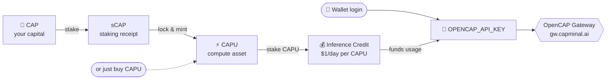
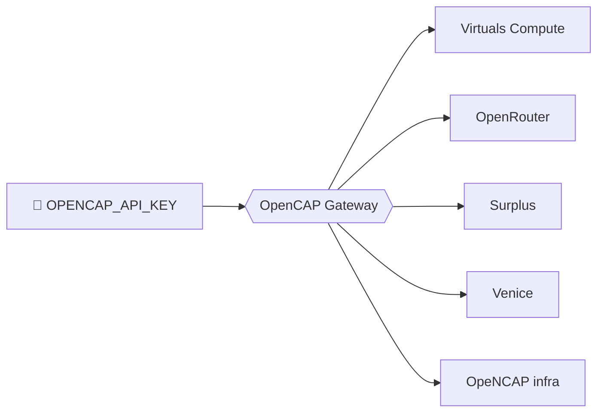

# OpenCAP Gateway

_One key. Every model. Powered by your staked CAPU — no subscription, no credit card._

OpenCAP Gateway is a unified, OpenAI-compatible LLM gateway at `https://gw.capminal.ai`. Instead of
paying a monthly bill, your daily inference is funded by **staked CAPU**: stake it, get a daily
allowance of Inference Credit, create one API key, and point any client, terminal, or agent at a
single endpoint.

## What It Does

1. **Log in with your wallet** that holds staked CAPU.
2. **Earn daily Inference Credit** — **$1 of inference per staked CAPU, every day**, renewed at
   00:00 UTC (non-rolling).
3. **Create an `OPENCAP_API_KEY`** from the dashboard.
4. **Point any OpenAI-compatible client** at `https://gw.capminal.ai/api/inference/v1` — usage draws
   down your daily Credit automatically, then falls back to a prepaid USDC balance if you top up.


## Mint & Stake CAPU → Daily Inference Credit

The model separates your **capital** from your **compute** — minting compute never spends your
principal.

| Asset    | What it is                        | What it does for you                          |
| -------- | --------------------------------- | --------------------------------------------- |
| **CAP**  | The token you already hold        | Your capital. You lock it, you never lose it. |
| **sCAP** | A receipt for locking CAP         | Proves your CAP is staked, and earns CAP.     |
| **CAPU** | The compute asset                 | Stake it for **$1/day of Inference Credit**.  |

Two ways to get CAPU, then stake it:

- **Path A — just buy it:** `Buy CAPU → Stake CAPU → $1/day per CAPU`. No CAP required.
- **Path B — lock & mint:** `Stake CAP → sCAP → mint CAPU → Stake CAPU`, earning CAP staking yield
  **and** Inference Credit at once. Burn CAPU later to unlock your original CAP.



> Inference Credit is tied to your **staked** CAPU. Stake more → larger daily allowance. It resets
> daily and does **not** roll over. Full details: the Mint CAPU and Gateway docs linked below.

## Gateway Providers — powered by Virtuals Compute

A single `OPENCAP_API_KEY` routes across multiple gateway providers behind one endpoint:

`virtuals` · `openrouter` · `surplus` · `venice-ai` · **OpeNCAP** (OpenCAP's own infra)


**Virtuals Compute is an integrated OpenCAP Gateway provider** — and inference capacity from the
**Virtuals program is being used to run OpenCAP Gateway inference**. You can pin providers per
request with a `provider` allow-list; omit it and a combo model picks the cheapest available.



## Fund Your Inference

Both sources fund the same key — daily staking Credit is used first, then a prepaid USDC balance:

| Funding source                          | What it is                                             | Best for                        |
| --------------------------------------- | ------------------------------------------------------ | ------------------------------- |
| **Inference Credit from CAPU staking**  | Daily allowance, $1/day per staked CAPU, non-rolling.  | Steady, recurring usage.        |
| **USDC Top-Up** (via MoonPay)           | A prepaid balance that carries over until spent.       | Bursts above your daily credit. |


## Quick Start

**Base URL:** `https://gw.capminal.ai/api/inference/v1`

```bash
export OPENCAP_API_KEY="ocap_..."

curl https://gw.capminal.ai/api/inference/v1/chat/completions \
  -H "Authorization: Bearer $OPENCAP_API_KEY" \
  -H "Content-Type: application/json" \
  -d '{
    "model": "claude-opus-4.8",
    "messages": [{"role": "user", "content": "Hello from OpenCAP"}],
    "stream": true
  }'
```

**Pin providers (optional)** — route only to specific gateways, e.g. Virtuals:

```bash
curl https://gw.capminal.ai/api/inference/v1/chat/completions \
  -H "Authorization: Bearer $OPENCAP_API_KEY" \
  -H "Content-Type: application/json" \
  -d '{
    "model": "glm-5.2",
    "provider": ["surplus", "virtuals"],
    "messages": [{"role": "user", "content": "Hello from OpenCAP"}]
  }'
```

Supported providers: `openrouter`, `surplus`, `virtuals`, `venice-ai`.

**OpenCode** (`~/.config/opencode/opencode.json`):

```json
{
  "$schema": "https://opencode.ai/config.json",
  "provider": {
    "opencap": {
      "npm": "@ai-sdk/openai-compatible",
      "name": "OpenCAP Gateway",
      "options": {
        "baseURL": "https://gw.capminal.ai/api/inference/v1",
        "apiKey": "{env:OPENCAP_API_KEY}"
      },
      "models": { "claude-opus-4.8": { "name": "Claude Opus 4.8" } }
    }
  }
}
```

The gateway also works with **OpenClaw** and **Hermes** using the same base URL and key — see the
OpenCAP Gateway docs for those config snippets.

> Keep your `OPENCAP_API_KEY` secret — anyone with it can spend your daily Inference Credit. Set a
> per-key daily cap, change expiration, or revoke it anytime from the dashboard.

## Package Layout

```
showcase/opencap-gateway/
  README.md          # this file
  showcase.json      # showcase card manifest
```

Screenshots are hosted in the [Capminal docs repo](https://github.com/Capminal/capminal-gitbook)
under `.gitbook/assets/` and linked directly via `raw.githubusercontent.com`.

## Links

- **Demo video:** https://x.com/AndreaPN/status/2072571388410638627
- **Gateway endpoint:** `https://gw.capminal.ai/api/inference/v1` · site: https://capminal.ai
- **Mint CAPU (the model):** https://github.com/Capminal/capminal-gitbook/blob/main/capminal/product-features/mint-capu.md
- **OpenCAP Gateway docs:** https://github.com/Capminal/capminal-gitbook/blob/main/capminal/opencap/gateway.md
- **Builder:** AndreaPN | 404AI Labs — https://www.404ai.io/

---

_Inference Credit is $1/CAPU/day on the OpenCAP Gateway, renewed daily at 00:00 UTC and
non-accumulating._
