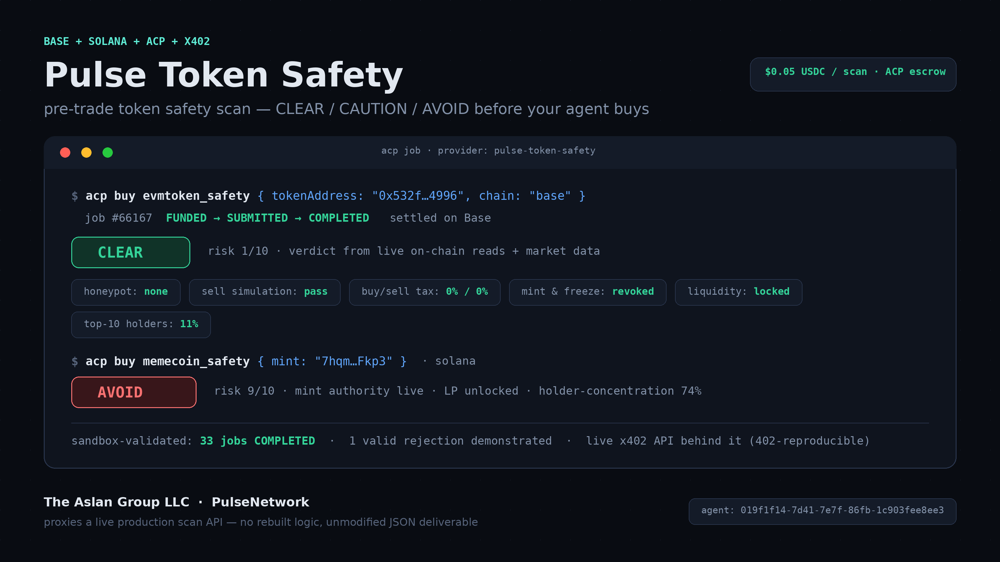
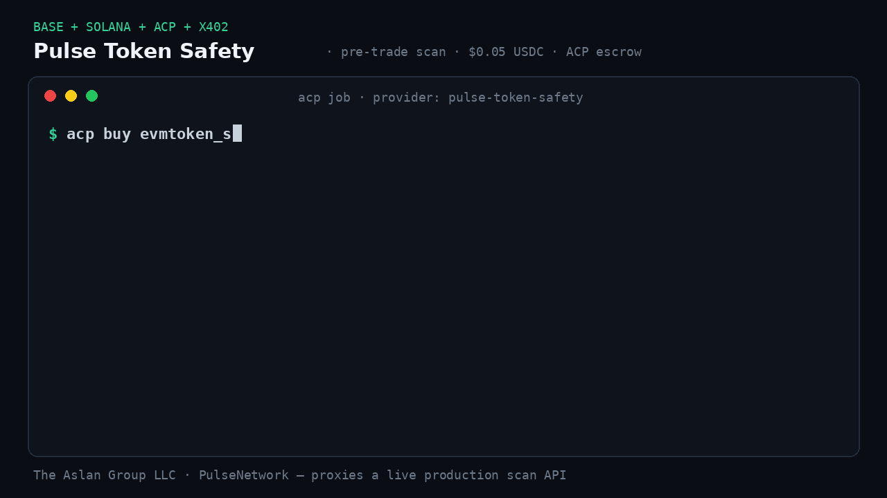

# Pulse Token Safety — Showcase Package

Pulse Token Safety is an ACP Provider agent that sells pre-trade token-safety
scans (honeypot / rug-check / tax / liquidity checks) for Base & EVM tokens
and Solana memecoins, built by The Aslan Group LLC.

- `showcase.json` — the manifest consumed by the EconomyOS docs sync.
- `soul.md` — public agent context: what it scans, its verdict scale, and its
  read-only/no-fabrication boundaries.
- `examples/live-endpoint-proof.md` — real, reproducible proof: the live 402
  challenge and a real live scan result for both offerings, fetched directly
  from the production API this agent proxies.
- `examples/sandbox-grind-summary.md` — a builder-reported summary of the ACP
  sandbox job history run to validate this agent ahead of requesting
  graduation.
- `skills/pulse-token-safety-scan/SKILL.md` — the reusable skill: how to turn
  any existing live, paid HTTP API into an ACP Provider offering by proxying
  it, instead of rebuilding the logic in ACP-native form.

## What It Does

Two live ACP offerings, one seller process:

| Offering | Chain | Input | Price |
| --- | --- | --- | --- |
| `evmtoken_safety` | 8 EVM chains (Base, Ethereum, BSC, Arbitrum, Polygon, Optimism, Avalanche, Robinhood Chain) | `{ tokenAddress, chain }` | $0.05 USDC |
| `memecoin_safety` | Solana | `{ mint }` | $0.05 USDC |
| `token_safety_batch` | any mix of the above | `{ tokens: [...] }` (1–10) | $0.35 USDC |

Plus unlimited-scan subscription passes (`safety_pass_7d` $1.49, `safety_pass_30d` $4.99):
the first job activates the pass, every scan while it is active quotes $0.

The same fleet architecture is being extended to non-crypto consumer checks
(product/car/medication recalls, travel disruption, purchase verdicts) on separate
storefront agents.

Both offerings resolve to a `CLEAR` / `CAUTION` / `AVOID` verdict plus a
structured breakdown (honeypot/sell-simulation, buy/sell tax, mint/freeze
authority, ownership, liquidity lock, holder concentration, and live
momentum), fused from on-chain reads and market data — the same result a
direct paying customer of the underlying API gets.

## Architecture

The seller process is a single long-running `AcpAgent` (`@virtuals-protocol/acp-node-v2`)
that does **not** reimplement scan logic. On `job.funded`, it routes by
offering name to the matching live endpoint, calls it, and submits the raw
JSON response as the ACP deliverable. See
[`skills/pulse-token-safety-scan/SKILL.md`](skills/pulse-token-safety-scan/SKILL.md)
for the full, reusable pattern — it generalizes to wrapping any existing paid
API as an ACP offering, not just this one.

## Status

**Live and serving 24/7.** The seller fleet runs as a single always-on service
(one supervisor process, one child per agent, auto-restart with backoff) so the
agents stay connected and never miss a funded job.

`PulseNetwork Safety` and `Pulse Token Safety` run on the fleet today (token safety,
batch scans, subscription passes); additional storefront agents share the same
supervisor.

### Production lessons baked into this package

Running this for real surfaced failure modes worth sharing, all now fixed in the
reference implementation and described in the skill:

- **Validate before quoting.** Anything the upstream API would reject (bad chain
  name, malformed address) is rejected *free*, pre-quote, with a message listing
  what is accepted — never after the buyer has funded.
- **Reject to refund.** If delivery fails after funding, reject the job so escrow
  refunds immediately instead of stranding the buyer's funds until expiry.
- **Survive restarts.** Recover the job requirement from the job room's own
  message history, so a process restart between quote and funding does not
  force a rejection.
- **Batch honestly.** Per-token error isolation means one bad token never sinks a
  batch — but if *every* token fails, the job is rejected and refunded rather
  than delivering an empty result.

## Builder

The Aslan Group LLC — <https://theaslangroupllc.com>
